<div align="center">


<a href="https://git.io/typing-svg">
  
</a>

<br/>


<p>
  <a href="https://linkedin.com/in/vipulchinmay"></a>
  <a href="https://linkedin.com/in/vipulchinmay"></a>
  <a href="mailto:m.sai.vipul.18@gmail.com"></a>
  <a href="https://github.com/vipulchinmay"></a>
</p>


</div>

<br/>

## 🧠 About Me

```yaml
name: M Sai Vipul Chinmay
role: AI Engineer Intern @ Krignal Technologies
focus: LLM Systems · RAG Architecture · Multi-Agent AI · Search & Ranking
education: Final-Year B.Tech, Computer Science
location: Hyderabad, India
```

I'm a final-year Computer Science undergraduate and **AI Engineer Intern at Krignal Technologies**, where I design and ship LLM pipelines, multi-agent AI architectures, and RAG systems that power real-time content generation, tagging, and insight delivery for professional communities. My engineering foundation spans backend systems, distributed data stores, and full-stack product delivery, layered with a deep specialization in **information retrieval, learning-to-rank, and semantic search**.

I care about the intersection of classical IR (BM25, TF-IDF) and modern neural retrieval — building systems that are not just accurate offline, but fast, scalable, and production-ready. Comfortable owning a feature from data pipeline to deployed API, with hands-on cloud experience through AWS's Solutions Architecture simulation and a growing set of Anthropic Claude / AI-fluency credentials.

**🔭 Open To:** AI/ML Engineering roles · Search & Ranking Engineering · Backend/Full-Stack roles with an ML surface · Research collaborations in IR & LLM systems

<br/>

## 🛠️ Tech Stack

**Languages**


**Frontend**


**Backend & Databases**


**Cloud, DevOps & Tooling**


<br/>

## 🤖 AI / ML Expertise

| Domain | Proficiency | Details |
|---|:---:|---|
| LLM Fine-Tuning & RAG | ⭐⭐⭐⭐ | LangChain, LangGraph, HuggingFace Transformers, retrieval-augmented pipelines |
| Multi-Agent AI Architecture | ⭐⭐⭐⭐ | Specialized agents for summarization, forecasting, opportunity detection, contextual insights |
| Information Retrieval & Ranking | ⭐⭐⭐⭐⭐ | BM25, TF-IDF, Learning-to-Rank (LTR), NDCG/MRR/Precision@K evaluation |
| Vector & Semantic Search | ⭐⭐⭐⭐ | FAISS, sentence-transformers, query understanding |
| Classical ML | ⭐⭐⭐⭐ | scikit-learn, LightGBM |
| Model Evaluation & A/B Testing | ⭐⭐⭐⭐ | Offline evaluation frameworks, ranking comparison pipelines |

<br/>

## 🚀 Featured Projects

<details>
<summary><b>🔍 Search Ranking Pipeline — BM25 + Neural Reranker</b></summary>
<br/>

Two-stage retrieval system combining BM25 candidate generation with a cross-encoder reranker, evaluated on the Amazon ESCI dataset, with a LightGBM learning-to-rank layer over semantic features.

| Aspect | Detail |
|---|---|
| **Stack** | LightGBM, FAISS, sentence-transformers, FastAPI, AWS |
| **Scale** | Amazon ESCI dataset, two-stage retrieval pipeline |
| **Performance** | 12% NDCG@10 improvement over BM25 baseline |
| **Latency** | Sub-200ms P95 on deployed serving endpoint |
| **Impact** | Offline A/B evaluation framework for ranking approach comparison |
| **Repository** | Private — actively in development |

Built as an end-to-end demonstration of production-grade search relevance engineering — from candidate generation through reranking to a deployed, latency-optimized API.

</details>

<details>
<summary><b>📚 Seekhan — RAG-Powered AI Quiz Generator</b></summary>
<br/>

A RAG-powered application that ingests educational documents and generates structured quizzes (MCQ, True/False, Fill-in-the-blank) through a conversational interface for educators.

| Aspect | Detail |
|---|---|
| **Stack** | LangChain, FAISS, HuggingFace, React.js, Node.js |
| **Scale** | Full document ingestion + chunking + semantic retrieval pipeline |
| **Performance** | Factual consistency evaluation on generated quiz content |
| **Security** | Structured output generation reduces hallucination risk |
| **Impact** | Natural language interface for tailored quiz generation |
| **Repository** | [github.com/spentuker/projectseekhan](https://github.com/spentuker/projectseekhan) |

Focused on marrying retrieval-grounded generation with a genuinely usable, low-friction interface for non-technical educators.

</details>

<details>
<summary><b>💊 AushadX — Multilingual Medicine Assistance App</b></summary>
<br/>

A full-stack MERN application that extracts medicine details from images via OCR and provides multilingual medical guidance and health tracking.

| Aspect | Detail |
|---|---|
| **Stack** | MongoDB, Express.js, React.js, Node.js, Easy-OCR, Docker |
| **Scale** | 5+ language NLP pipeline, containerized deployment |
| **Performance** | Fine-tuned medical QA model for domain-specific responses |
| **Security** | Dockerized deployment on AWS |
| **Impact** | Geolocation-based hospital discovery + medication tracking dashboard |
| **Repository** | [github.com/vipulchinmay/projectaushadX](https://github.com/vipulchinmay/projectaushadX) |

Designed to make medicine information accessible across language barriers, pairing OCR extraction with a domain-tuned QA model.

</details>

<details>
<summary><b>🎙️ AiVoiceAssistant</b></summary>
<br/>

_Add a short description of what this project does and what problem it solves._

| Aspect | Detail |
|---|---|
| **Stack** | _Add tech stack_ |
| **Scale** | _Add details_ |
| **Performance** | _Add details_ |
| **Security** | _Add details_ |
| **Impact** | _Add details_ |
| **Repository** | [github.com/vipulchinmay/AiVoiceAssistant](https://github.com/vipulchinmay/AiVoiceAssistant) |

_Add a 2-3 sentence explanation once the details above are filled in._

</details>

<br/>

## 💼 Experience

**AI Engineer Intern — Krignal Technologies**
`Nov 2025 – Present · Hyderabad, India`

Designing and building AI-driven backend services powering content generation, tagging, access control, and real-time insight delivery across professional communities.

- Contributing to a multi-agent AI architecture with agents specialized in summarization, forecasting, opportunity detection, and contextual insights
- Building frontend dashboards, personalized insight feeds, and expert–member interfaces
- Implementing role-based permissions and secure onboarding flows for experts, members, and administrators
- Supporting AI agent evaluation and prompt experimentation across personas, tone styles, and community contexts using RAG pipelines and fine-tuned transformers
- Participating in QA, testing, and performance optimization for scalable AI outputs across devices

`LLM Pipelines` `RAG` `Multi-Agent Systems` `Prompt Engineering` `Access Control` `Full-Stack`

<br/>

## 🏆 Achievements

<div align="center">

| Recognition | Details |
|---|---|
| AWS Solutions Architecture Job Simulation (Forage) | Designing a simple, scalable hosting architecture |
| 12% NDCG@10 Improvement | Search Ranking Pipeline project result vs. BM25 baseline |

</div>

<br/>

## 📜 Certifications

**Anthropic (Claude)**


**Anthropic — AI Fluency Program**

- AI Fluency: Framework & Foundations
- Teaching the AI Fluency Framework
- AI Fluency for Students
- AI Fluency for Educators
- AI Fluency for Nonprofits — with GivingTuesday
- AI Fluency for Small Businesses — with PayPal

**Forage Job Simulations**

- Accenture — Software Engineering Job Simulation (Aug 2025)
- AWS — Solutions Architecture Job Simulation (Jun 2025)

<!-- Add Oracle / NPTEL / Cisco certifications here as badges once confirmed -->

<br/>

## 💻 Coding Profiles

<p>
  <a href="https://leetcode.com/u/M_Sai_Vipul_Chinmay/"></a>
  <a href="#"></a>
  <a href="#"></a>
  <a href="#"></a>
</p>

<sub>Add your profile links to activate these badges.</sub>

<br/>

## 📊 GitHub Analytics

<div align="center">






</div>

<br/>

## 🏅 GitHub Trophies

<div align="center">



</div>

<br/>

## 📈 Contribution Activity

<div align="center">


</div>

<br/>

## 🐍 Contribution Snake

<div align="center">


</div>

<br/>

## 🎯 Current Focus

```yaml
Learning:
  - Advanced Learning-to-Rank architectures
  - Multi-agent orchestration patterns (LangGraph)
  - Large-scale vector search optimization

Building:
  - Production RAG systems with evaluation harnesses
  - Ranking-aware retrieval services

Exploring:
  - Blockchain technology
  - Emerging AI system design patterns

Open To:
  - AI/ML Engineering roles
  - Search & Ranking Engineering roles
  - Research collaborations in IR & LLM systems
```

<br/>

## 📫 Connect

<p>
  <a href="mailto:m.sai.vipul.18@gmail.com"></a>
  <a href="https://linkedin.com/in/vipulchinmay"></a>
  <a href="https://github.com/vipulchinmay"></a>
  <a href="https://linkedin.com/in/vipulchinmay"></a>
</p>

<br/>

---

<div align="center">

_"Relevance is not a feature — it's the product."_


</div>
